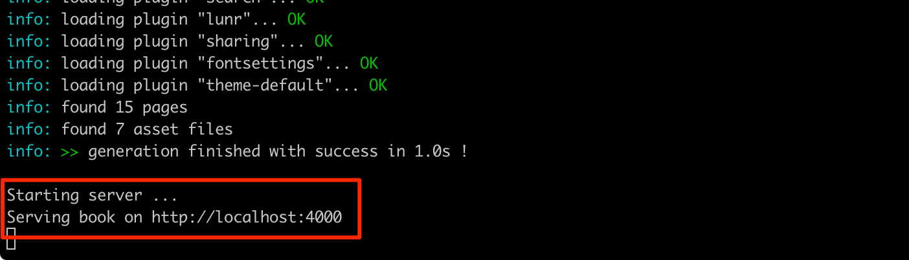

# LearnJS  » Contribute

Ahoy, welcome aboard!

LearnJS is an OpenSource initiative.

The whole source code is 
[available in our GitHub repo][1] and **we need your help to make LearnJS
a useful learning tool**.

## What can I do?

Here is a brief list of how you can impact the learning curve of
your fellow students:

- fix typos
- improve existing contents
- remove outdated resources from the exercise pages
- add relevant resources to the exercise pages
- create new exercise pages

## How can I do it?

There are mostly 3 possible ways to contribute:

- clone the repo and submit pull requests (see below)
- [submit new issues in the repo board][2]
- comment your ideas in the exercise page

## What the heck is a Pull Request anyway?

I'm glad you asked! 

1️⃣ A _Pull Request_ is a standard contribution practice in modern 
software development, you can make changes to the project's code base 
and you can submit them for approval.

2️⃣ The approval process is usually community driven.

The collaborators in the project can use a message board to review, 
discuss and maybe ask for some changes.

3️⃣ When everyone is satisfied, the change will be accepted and published.

> The cool thing is that **your contribution will be listed in the 
> project's history** and you can use it during interviews to 
> **prove your skills and good will with a potential employer 🤠**.

#### Learn more about Open Source contributions

- [This seems to me a very simple beginner guide to OS contributions][3]
- [Alternative guide that takes branching into account][4]

#### The Golden Rule of Pull Requests

- few
- focused
- changes

A good scope would be a single exercise page.  
Pick one and do your best in order to improve it.  
Then submit it.

**If you want to fix more stuff, use branches and create multiple PRs 🤠.**

## How do I work on the project?

**NOTE:** this step assumes you have succesfully forked the project in your
GitHub account, and cloned it locally to your machine.

This website is statically generated using [GitBook.io][5].

> Althoug it is going under deprecation, it is still a very good tool to quickly 
> build a good looking documentation project.

All the contents are written in [Markdown language][6], which is a human readable
markup language that easily transpiles into _HTML_. I know... there is a lot to 
take in here, but it's easier learned than explained. [Just give it a go with this
tutorial][6].

#### Prerequisites

- you should have the latest codebase locally
- you should be able to run node 10.x
- you should be able to edit text files (ex with [VSCode][7])

#### Run the project

Before starting a work session make sure you have the latest source code, then also
make sure all the dependencies are correctly installed by running:

```
npm install
```

At this point you can run the project:

```
npm start
```

You should see some logs running for a while, then when everything works fine
you shoud see this final message:



Now you can open your favourite browser (Chrome or Firefox!) and point it to:

http://localhost:4000

You should see the full website, but now it's running on your machine, and it's
updating every time you touch a file.

#### Source Files & Folder Structure

The public website is hosted with [GitHub pages][8] which is a great **and free** way
to host static websites.

The bottom line is that the `/docs` folder should never be touched. It contains the
transpiled version of the project and it is used by GitHub only.

When you work with the contents you need to dig into the `/contents` folder, which
contains all the source files.

Each page is represented by a `page-name/README.md` file.

> There is a good reason for this decision: [Open Closes Principle][9]

#### Challenge n.1

1. navigate to a specific exercise in the local website
2. identify the relative source file in your editor
3. change the title
4. observe that the website updates (may take a few seconds)

#### Challenge n.2

1. learn how to create links in Markdown [using the tutorial][6]
2. find some relevant tutorials or videos for a specific page
3. add the link
4. create your first Pull Request


[1]: https://github.com/marcopeg/learnjs
[2]: https://github.com/marcopeg/learnjs/issues
[3]: https://github.com/firstcontributions/first-contributions/blob/master/README.md
[4]: https://akrabat.com/the-beginners-guide-to-contributing-to-a-github-project/
[5]: https://github.com/GitbookIO/gitbook
[6]: https://www.markdownguide.org/getting-started
[7]: https://code.visualstudio.com/
[8]: https://pages.github.com/
[9]: https://en.wikipedia.org/wiki/Open%E2%80%93closed_principle